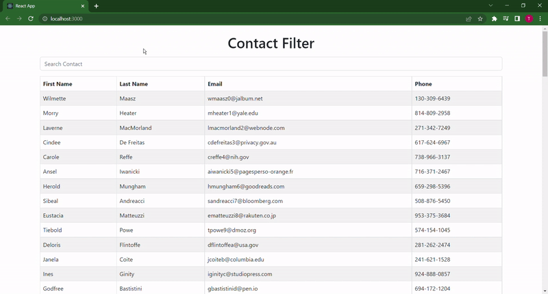

### Filtering feature

## Description
- Renders the data provided from JSON file using map function and filters the data based on the input using the filter function. 

## Features
- filtering thru the data and dispalying it
- reading and diplaying the user's data
- using bootstrap for simple UI table

## Filtering the data

## Technologies
- React (Frontend View Framework)
- React Hook (useState)
- Node (npm)
- Visual Studio Code (JavaScript IDE)
- React Bootstrap (form, container, table, input)
